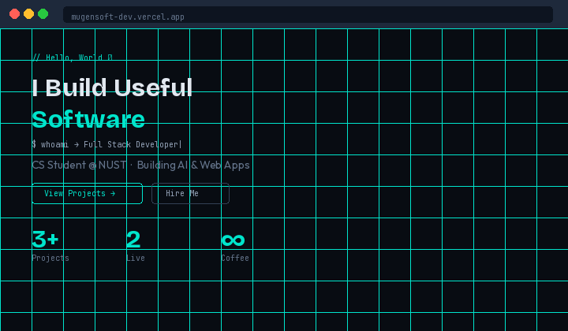

import { lazy, Suspense, useState } from 'react';
import { BrowserRouter, Routes, Route, useLocation, useNavigationType, NavigationType } from 'react-router-dom';
import { Analytics } from '@vercel/analytics/react';
import { ThemeProvider } from './components/ThemeProvider';
import Loader from './components/Loader';
import RouteFallback from './components/RouteFallback';
import Home from './pages/Home';
import useReveal from './hooks/useReveal';
import useScrollRestoration from './hooks/useScrollRestoration';
import usePageAnalytics from './hooks/usePageAnalytics';
import AskMe from './components/AskMe';

# MugenSoft — Developer Portfolio

**Live:** [mugensoft-dev.vercel.app](https://mugensoft-dev.vercel.app) · **GitHub:** [@LimitlessXOD](https://github.com/LimitlessXOD)



Full-stack developer portfolio for **Erastus (Leroy) Shalimba** — built to ship, not just to look good. Supabase-powered backend, animated scroll reveals, dark/light mode, route-based page transitions, and a working guestbook and contact form.

---

## Features

- **Page transitions** — route-aware slide animations (forward/back) with custom scroll restoration
- **Scroll reveal** — IntersectionObserver-based reveal system that correctly handles back-navigation race conditions
- **Guestbook** — real messages stored in Supabase, displayed live
- **Contact form** — submissions land in Supabase + trigger a Supabase Edge Function email notification
- **Dark / Light mode** — persisted via `data-theme` on `<html>`, no flash on load
- **Typing effect** — cycling role display in the hero (`useTyping` hook)
- **Blog** — three long-form posts with full content rendered from data
- **Project landing pages** — dedicated pages for Chess Platform and MUGEN Desktop App
- **Mobile-first** — fully responsive, tested down to 375px
- **OG / Twitter cards** — social preview image, description, and title set in `index.html`

---

## Projects Showcased

| # | Project | Stack | Status |
|---|---------|-------|--------|
| 01 | [Ultimate Chess Showdown](https://chess-project-1-y6c5.onrender.com) | React, Node.js, Socket.io, WebSockets | 🟢 Live |
| 02 | MUGEN Desktop Media App | Desktop, yt-dlp, Media Player | 🔵 Personal |
| 03 | MugenSoft Portfolio (this site) | React, Vite, Supabase, Tailwind CSS | 🟢 Live |

---

## Tech Stack

| Layer | Tech |
|-------|------|
| Frontend | React 19, React Router 6, Tailwind CSS 4 |
| Build | Vite 8 |
| Backend / DB | Supabase (Postgres + Edge Functions) |
| Deployment | Vercel |
| Fonts | Outfit (body), Space Mono (code/labels) |
| Analytics | Vercel Analytics |

---

## Project Structure

```
src/
├── components/       # Section components (Hero, About, Projects, Skills…)
├── hooks/
│   ├── useReveal.js           # IntersectionObserver scroll reveal
│   ├── useScrollRestoration.js # sessionStorage-based scroll position save/restore
│   └── useTyping.js           # Cycling typing effect
├── pages/            # Route-level pages (Home, ProjectsHub, ProjectPage, BlogPost…)
├── data/
│   └── portfolioData.js  # All content — projects, skills, services, blog posts
├── App.jsx           # Router, scroll restoration, reveal hook, ThemeProvider
└── main.jsx
public/
├── sitemap.xml
├── robots.txt
├── og-image.png
└── mugensoft-cv.pdf
supabase/
└── functions/notify-contact/  # Edge Function — email on contact form submit
```

---

## Getting Started

### Prerequisites

- Node.js 18+
- A [Supabase](https://supabase.com) project with two tables: `comments` (guestbook) and `contact_messages` (contact form)

### Installation

```bash
git clone https://github.com/LimitlessXOD/mugensoft-portfolio.git
cd mugensoft-portfolio
npm install
```

### Environment Variables

Create a `.env` file in the project root:

```env
VITE_SUPABASE_URL=your_supabase_project_url
VITE_SUPABASE_ANON_KEY=your_supabase_anon_key
```

### Development

```bash
npm run dev
```

### Production Build

```bash
npm run build
npm run preview
```

### Deploy to Vercel

The project is pre-configured for Vercel. Connect the repo, add your env vars in the Vercel dashboard, and deploy. The `public/404.html` handles SPA client-side routing on Vercel.

---

## SEO

- Primary meta description in `index.html`
- Open Graph tags (LinkedIn, WhatsApp, Facebook previews)
- Twitter Card (`summary_large_image`)
- `public/sitemap.xml` — all routes declared with `lastmod` and `priority`
- `public/robots.txt` — crawlers allowed, sitemap referenced

---

## Architecture Notes

**Scroll + Reveal Race Condition (solved)**
Back-navigation triggers three simultaneous async operations: `PageTransition` animates the incoming page over 380ms, `useScrollRestoration` restores scroll position via double-`requestAnimationFrame`, and `useReveal` re-evaluates element visibility. The original code queried the DOM synchronously at effect-flush time — before the animation settled and before scroll was restored — causing `getBoundingClientRect()` to return wrong positions and leaving sections invisible. Fixed by deferring the `isPop` reveal branch inside a `setTimeout(400)` and moving the `querySelectorAll` inside it, so the DOM is queried only after the page has fully painted and scroll is in its final position.

**Duplicate Tailwind Import (fixed)**
Both `App.css` and `index.css` previously imported `@import "tailwindcss"`, injecting Tailwind's base reset twice and producing inconsistent `offsetHeight` values during transitions. Removed from `App.css`, kept only in `index.css`.

---

## Roadmap

- [ ] Chess Platform v2 — ELO rating system + better matchmaking
- [ ] AI productivity dashboard
- [ ] SaaS landing page templates pack
- [ ] Open-source React component library
- [ ] TypeScript migration
- [ ] Vitest unit tests for hooks
- [x] Route code-splitting (React.lazy)
- [x] ESLint cleanup (modern JSX imports)
- [x] Hash scroll when navigating to `/#section` from other pages
- [x] Projects hub — search, category, tech stack, featured, sort
- [x] Analytics events (Supabase) + Vercel Analytics
- [x] Contact quick actions (resume, book call / WhatsApp)

See [ROADMAP.md](./ROADMAP.md) for MDX blog, admin CMS, AI features, and more.

---

## License

MIT — use freely, credit appreciated.

Built in Windhoek, Namibia 🇳🇦

function AppContent() {
  const [loading, setLoading] = useState(true);
  // ...
